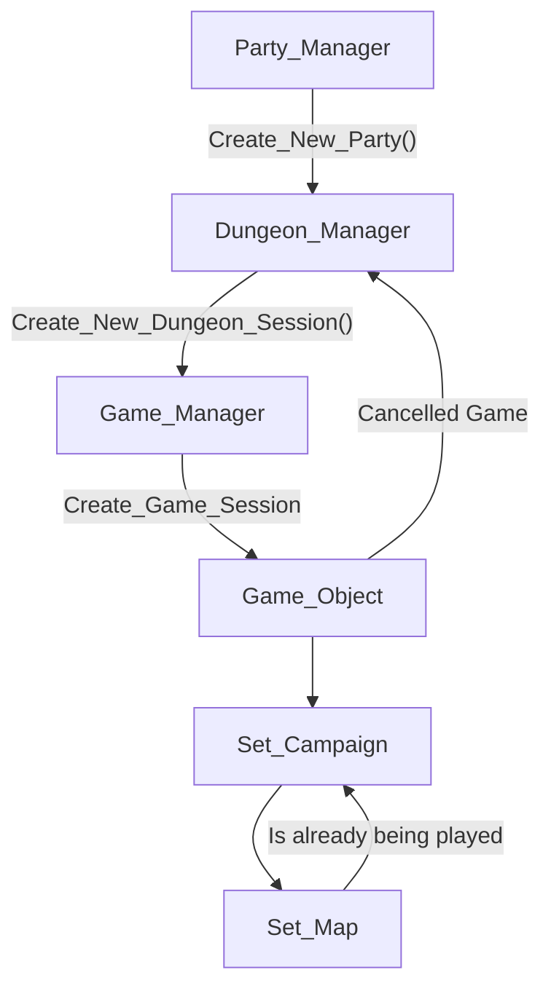

## Dungeons System


## Game Seperation



A Game is like a session, it is an abstract class that handles a game locally.
Methods: 
```JAVA
public abstract class Game {
    
    private int minPartySize;
    
    public Game (int minPartySize) {
        
    }
    
    public void onGameReady () {
        // Is triggered when all criteria for the Game is ready. 
    }
}
``` 
